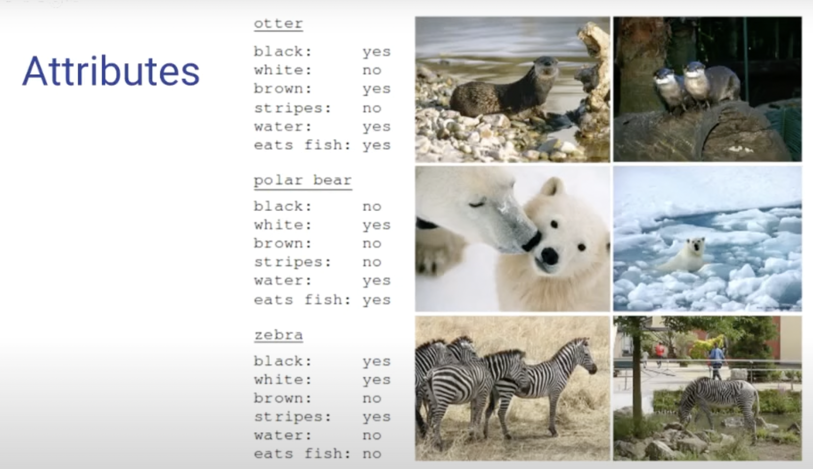

# GPT2 : Language Models are Unsupervised Multitask Learners

## Background Terminology & Keywords

[F1 score](https://sumniya.tistory.com/26); `scikit-learn`; [zero shot learning](https://deep-learning-study.tistory.com/873); [Semantic Segmentation](https://m.blog.naver.com/mincheol9166/221736294296); [Auxiliary classifier](https://technical-support.tistory.com/87);
[overfit/underfit](https://ko.d2l.ai/chapter_deep-learning-basics/underfit-overfit.html); [GLUE](https://velog.io/@raqoon886/GLUE); `joint probability`; `product probability`

## zero-shot learning

- 유튜브 참조
    
    [2배속으로 빠르게 이해가능](https://www.youtube.com/watch?v=7uAszeiLE2w)
    
    [영어라서 다 보지 못했음…. ](https://www.youtube.com/watch?v=0iKsimVvfjE)
    
    

학습데이터 = 이미지(0/X) + `class`(ex : 사자, 개, 고양이, 돌고래, 북극곰, 얼룩말) + 특성(`attribute`)

테스트 단계에서 새로운 이미지에 대한 클래스의 예측을 하는 것이 목표

(해당 클래스는 학습단계에서 특성만 주어지고 이미지는 제공되지 않는다.)

`attributes`

## 초록

nlp는 지도 학습(WebText) 으로 여러 tasks (QA, MT, 요약 등)에서 성과를 얻어냈다.

또한 최근의 연구에서 일부 지도 학습을 비지도 방식으로 변환시키는 시도로서 여러 성과를 냈다.

그러나 여전히 지도학습이 요구되고, GPT2는 LM에서 비지도 학습만을 통해 모델을 학습시키고자 한다.

위의 시도가 유의미한 성과를 내보임으로서 naturally occurring demonstrations 을 통해 task를 수행하는 새로운 길을 제시한 것에 의의가 있다.

다음은 GPT2에서 보이는 성능과 특성

GPT2 LM 의 크기는 zero-shot task transfer 을 실현시키는데 중요한 요인이면서 부피를 증가시킬수록 로그적으로 성능을 향상시킨다.$^1$

- GPT2는 1.5B의 parameter transformer : GPT1 에 비해 상당히 크기가 커졌다.
- zero-shot setting의 데이터셋에서 우수한 성능 (SOTA 7/8 달성)
- WebText 상에서 underfit 문제

위와 같은 사실은 실험 결과에 반영되므로 이를 염두에 두고 결과를 살펴볼 필요가 있음.

## 서론

ML 시스템은 다양하고 큰 데이터셋과 지도된 학습으로 실현된 tasks에서 우수하다. 

그러나 해당 방식은 학습데이터의 분포(task에 따라)에 따라 유연하게 반응 못해. (narrow experts)

우리는 더 general 한 시스템으로 여러 상황에서 능력 수행이 가능하도록 만들고 싶다. (competent generalist)

ML 에 대한 기존의 지배적인 접근 방식은 task-specific 한 데이터셋 학습 후, 독립된(test≠train) 같은 task상(indpendent and identically distributed) 에서 테스트 진행하여 성능을 평가.——> narrow experts

해당 방식에서 문제 발생 (captioning models, reading comprehension, image classifier )

우리는 문제의 원인이 task-specific 한 학습방식이라고 의심(가설). 가설을 실험하기 위해서 새로운 모델의 성능을 시험할 수 있는 benchmarks 가 최근에 제시되었다.

(가설을 세우고 이를 실험해볼 수 있는 기반이 마련되었다고 이해했다.)

Multitask learining 은 기존에 제시된 방법중에서 썩 좋은 성능을 보여주는 framework. 이를 NLP에 적용한 것은 별로 진척되진 않았다. 최근에 시도된 두가지의 참신한 노력(각각 10, 17개의 [데이터셋, 목적(task)] 쌍의 데이터셋으로 학습)은 큰 성과를 거두진 못했다. 해당 방식은 task-specific 한 데이터셋의 샘플에 불과함. 유의미한 학습이 이뤄지기 위해서는 이런 샘플들이 수백-수천개가 요구된다. 우리의 목표를 강행하기 위해서 해당 방식을 적용하면 상당한 수준과 양(양질)의 데이터가 요구되므로 매우 어렵다. 현재 방식(multitask learning)으로 성과를 내기 위해서는 데이터셋에 대한 처리과정이 상당히 요구된다. 

현재 가장 우수한 성능을 보여주는 언어 모델은 pre-training + supervised fine-tuning 이다. 여기로 오기까지 많은 단계를 거쳐왔다. 

- word embedding 학습되고 task-specific 에 들어감 (GPT)
- rnn의 contextual representation 이 task-specific 에 들어감 (BERT)

그리고 최근에는 task-specific architecture 필요 없고, 대신 self attention block으로 충분함’라는 방법이 제시되었다.

<aside>
❓ 즉, fine-tuning이 없이도 학습이 가능하다는 말인가?

</aside>

이 방법도 결국 지도학습이 조금은 필요하다. 최소한의 지도된 데이터 혹은 전혀 없을 때, 다른 쪽의 작업(비지도학습)에서는 특정 task를 실현시킬 수 있는 LM의 가능성을 보였다. (이건 구체적으로 제시가 안된건가..)

LM의 downstream task(specific task가 적용되는 부분)을 zero-shot setting을 통해 architecture, parameter의 일체 변형없이 구현이 가능하다고 말한다. (여기서 zero-shot 의 클래스 해당하는 부분이 task라고 유추) 해당 방식으로 zero-shot setting 된 task-general 능력을 강조할 수 있다. 

<aside>
👉 downstream-task : fine-tuning → zero-shot setting 하여 task-specific이 아닌 general 하게

</aside>

## 접근

1. LM
    1. self-attention architecture인 transformer 을 적용해서 LM을 설계했다.
2. 확률
    1. 기존의 $p(output|input)$ 에서, task-general 하게 하기 위해선 $task$ 라는 조건이 추가되어야 한다. 즉, $p(output|input, task)$ 으로 모델이 수정되어야 한다.(기존의 연구들에서 이미 형식화되었음) 이렇게 하면 2-step architecture 가 아닌 single architecture 로 학습이 가능하다.
        1. 기존의 연구들에서는 task-specific에 해당하는 작업이 architecture 수준, 즉 downstream task로 따로 제시되었는데, 어떤 연구에 따르면 언어는 유연한 방식으로 input, output, task를 구분할 수 있다는 것이다. (이게 근거가 된다는 것)
        2. 이를 구체화하여, task-specific 과 task-general 에 대해 사고실험을 들어 볼 수 있다. task-specific 의 경우 한 가지 task에 대한 최소값($\mathscr{L}$) ( : subset of the sequence) 을 구하고, task-general 의 경우 모든 task에 대한 최소값을 구하므로 결국 모두 global한 최솟값을 구하게 된다. (다만, 이를 실행하기 위해선 unsupervised model 이 커져야 할것)
3. 데이터셋
    1. task에 대한 큰 데이터셋을 얻기 위해 web에서 crawling 하여 데이터를 추출했다.
        1. 데이터의 양은 막대하지만 질적으로 유용하지 못한 문제
        2. 특정 target에 대한 데이터셋을 얻어내는 방법은 꽤 성공적이었으나, 결국 인력이 요구된다.
        3. 그래서 우리는 Reddit 에서 👍*2 이상 받은 글에 대해서만 데이터로 추출했다. (직접 quality를 매기지 않고, 다른 사람들에 의해 평가가 된 글)
    2. 이것을 WebText라고 명명하고 2017 이전까지만 작성된 글만을 포함, wikipedia와 겹치는 글은 삭제했다.
4. input representation : 모든 종류의 input string에 대해 적용 가능
    1. string 자체의 학습 가능한 특징을 저해시키는 tokenization, lower-casing, OOV 가 큰 사이즈의 LM에 적용된다.
    2. UTF 8byte 방식의 인코딩은 위의 문제점에 대한 해결책이 되지만 용량이 커지는 문제 발생
    3. 위 두가지 문제에 타협을 제시하는 방법으로 BPE를 들 수 있다.
        1. (자주 등장하는 sequence의 input으로 word-level), (덜 등장하는 sequence의 input으로 char-level) 간의 선형보간으로 두 level의 특징을 모두 담아낸다. 
        2. 그러나 이를 바로 적용하면 특정 단어에 대한 다양한 변화 dog. dog? dog! dog, 문제로 역시 용량문제 발생
        3. 따라서 BPE 가 char 항목에 대해 byte sequence 과 결합하지 않도록 했다.
5. 모델
    1. layer norm이 각각의 sub-block 의 input 단에서 이뤄지고 추가적인 layer norm이 마지막 transformer의 self-attention 이후에 또 적용된다
    2. initialization 에서 $\frac{1}{\sqrt{N}}$ 을 곱한다. ($N$은 layer의 갯수)
    

## 일반화 vs 기억

WebText가 상당히 많은 양의 데이터로서 모델을 학습시키므로 위의 experiments에 대한 test dataset과 중복될 수 있다. 즉 위에서 보여준 성능이 과연 일반화에 의한 것인지 데이터의 중복에 의한 기억에 의한 산물인지 알 수 없다. 따라서 이에 대한 논의는 상당히 요구된다.

학습데이터와 테스트데이터간의 중복을 확인하기 위한 방법으로 8-gram 으로 이루어진 Bloom fileter을 사용했다.

recall을 향상시키기 위해 오직 ‘lower-case의 알파벳 + 공백’ 으로만 이뤄진 단어들에 대해서 string norm을 적용했다. 여기서 FP는 최소가 $10^{-8}$가 되도록 설계했다.

위의 도구를 가지고 experiment에 대해 overlap 분석을 진행

overlap이 발생한 대비 F1 point의 증가 정도 분석을 통해 ‘일반화’에 대한 근거를 얻어냈다.

물론, overlap 즉 기억이 실험에서 작지만 더 좋은 성능을 내도록 하는 경향도 확인할 수 있었다.